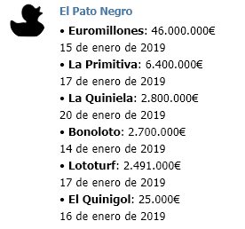

# Telegram Bot: El pato negro
Bot de Telegram para obtener información de los botes y próximos sorteos de Loterías y Apuestas del Estado.  
El bot obtiene directamente la información del RSS oficial de Loterías y Apuestas del Estado.

## Funcionalidad actual
/start  - Muestra la ayuda del bot.  
/help   - Muestra la ayuda del bot.  
/botes  - Muestra la información sobre los botes y fechas de los próximos sorteos ordenados por el bote de mayor a menor.  

 

## Futuras funcionalidades
/resultados   - Muestra los resultados del último sorteo para cada sorteo.

## Enlaces de interés
[LAE] https://www.loteriasyapuestas.es/es

## Donate to sustain our activities:
<form action="https://www.paypal.com/cgi-bin/webscr" method="post" target="_top">
<input type="hidden" name="cmd" value="_s-xclick" />
<input type="hidden" name="hosted_button_id" value="6LA36YG4NR6X2" />
<input type="image" src="https://www.paypalobjects.com/en_US/ES/i/btn/btn_donateCC_LG.gif" border="0" name="submit" title="PayPal - The safer, easier way to pay online!" alt="Donate with PayPal button" />

</form>
